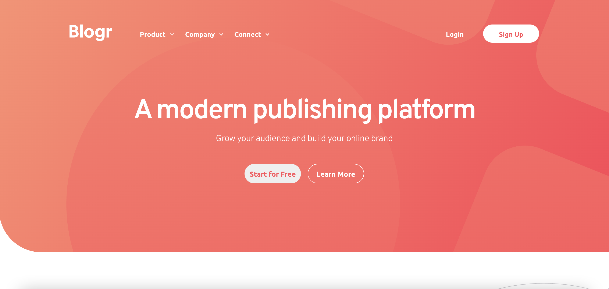

# Frontend Mentor - Blogr landing page solution

This is a solution to the [Blogr landing page challenge on Frontend Mentor](https://www.frontendmentor.io/challenges/blogr-landing-page-EX2RLAApP). Frontend Mentor challenges help you improve your coding skills by building realistic projects. 

## Table of contents

- [Overview](#overview)
  - [The challenge](#the-challenge)
  - [Screenshot](#screenshot)
  - [Links](#links)
  - [Built with](#built-with)
- [Author](#author)

## Overview

### The challenge

Users should be able to:

- View the optimal layout for the site depending on their device's screen size
- See hover states for all interactive elements on the page

### Screenshot

### Links

- Solution URL: [Github repo](https://github.com/katarzyna-kw/blogr-landing)
- Live Site URL: [Hosted by gh-pages](katarzyna-kw.github.io/blogr-landing/)

### Built with

- CSS custom properties
- Flexbox
- CSS Grid
- Mobile-first workflow
- Principles of semantic HTML5 markup
- [React](https://reactjs.org/) - JS library

## Author

- Website - [Katarzyna Wegrzynowicz Portfolio](https://github.com/katarzyna-kw/portfolio-website)
- Frontend Mentor - [@katarzyna-kw](https://www.frontendmentor.io/profile/katarzyna-kw)